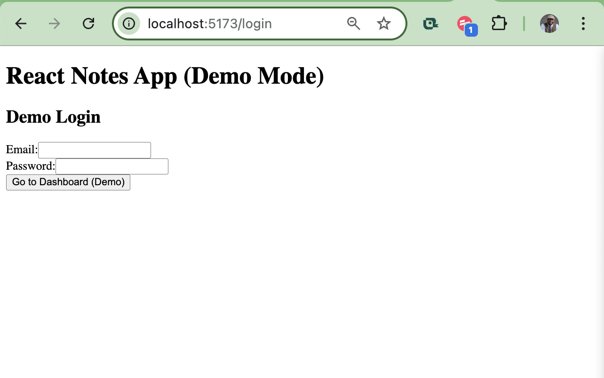
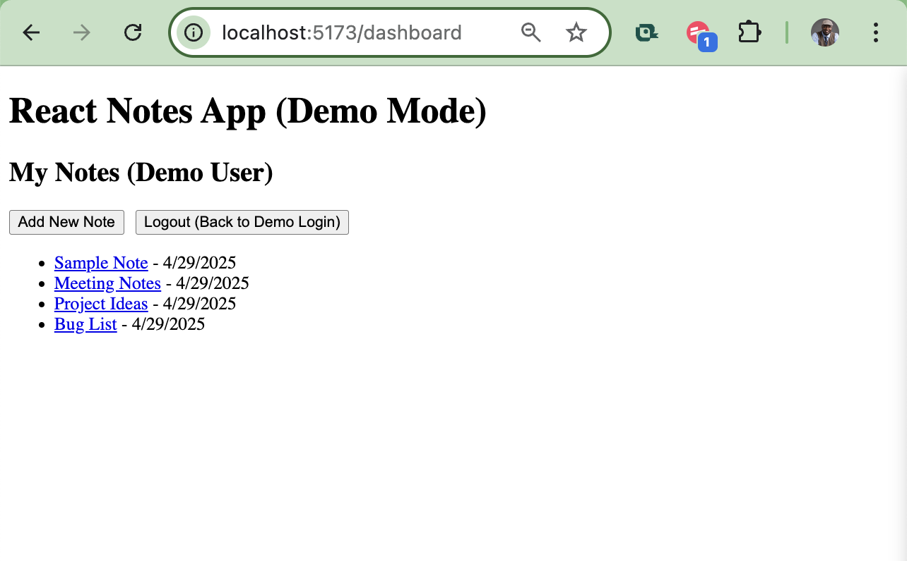
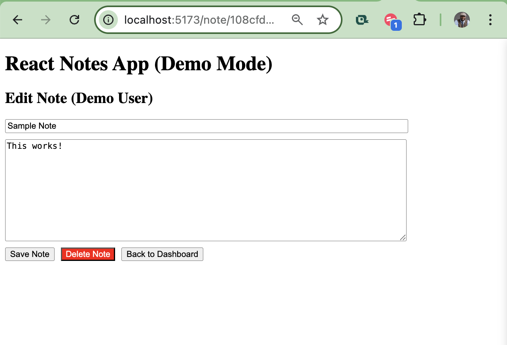

# React Notes App with Supabase

A minimal, beginner-friendly notes application built with React (using Vite) and Supabase. This project demonstrates fundamental concepts including user authentication, CRUD operations against a Supabase database, and basic React routing. It also highlights the use of demo mode for simplified testing and public portfolio use.

## 🔗 Live Demo

_(Optional: Link to your deployed version)_

## ✨ Features

- **🔐 User Authentication** (optional/demo): Built-in support for Supabase Auth, with the ability to bypass for demo.
- **📝 CRUD Operations**: Create, Read, Update, and Delete notes using Supabase database.
- **📦 Supabase Integration**: Uses `notesapp_notes` PostgreSQL table, with RLS policies.
- **📂 Demo Mode**: Allows public browsing/editing of predefined notes with a demo user UUID.
- **🛡️ RLS & Security Policies**: Full policy-based access using Supabase's built-in RLS.
- **🖼️ Preview Screenshots**: Easily visualize app flow.

## 🚀 Technologies Used

- [React](https://reactjs.org/)
- [Vite](https://vitejs.dev/)
- [Supabase](https://supabase.io/)
- [React Router](https://reactrouter.com/)
- JavaScript (ES6+)

## 🛠️ Setup and Installation

1. **Clone the repository:**
   ```bash
   git clone https://github.com/visaoenhance/react-notes-app-supabase.git
   cd react-notes-app-supabase
   ```

2. **Install dependencies:**
   ```bash
   npm install
   # or
   yarn install
   ```

3. **Set up Supabase project:**
   - Create a new Supabase project at [supabase.io](https://supabase.io/)
   - Go to SQL Editor, and run:
     - `docs/sql/schema.sql` → Creates the `notesapp_notes` table
     - `docs/sql/policies.sql` → Sets up RLS and policies
     - `docs/sql/demo_data.sql` → Inserts demo notes for UUID user
   - Enable Row Level Security on the table

4. **Add your Supabase credentials:**
   ```bash
   cp .env.example .env
   ```
   Replace the values with your own from Supabase Settings → API

5. **Run locally:**
   ```bash
   npm run dev
   ```
   Visit: [http://localhost:5173](http://localhost:5173)

## 🔐 Demo Mode vs Auth Mode

This project is configured to default to "Demo Mode," bypassing real authentication.

- Demo user UUID: `00000000-0000-4000-8000-000000000001`
- All notes in the demo are associated with that UUID
- You can toggle or update authentication logic to use Supabase Auth instead

## 📁 Folder Structure

```
react-notes-app-supabase/
├── docs/
│   └── sql/
│       ├── schema.sql
│       ├── policies.sql
│       └── demo_data.sql
├── public/
│   ├── preview-login.png
│   ├── preview-dashboard.png
│   └── preview-editor.png
├── src/
│   ├── components/
│   │   ├── Dashboard.jsx
│   │   ├── Login.jsx
│   │   └── NoteEditor.jsx
│   ├── App.jsx
│   ├── main.jsx
│   └── supabase.js
├── .env.example
├── .gitignore
├── README.md
└── vite.config.js
```

## 🖼️ Preview Screens





## 📄 License

This project is licensed under the MIT License. See [LICENSE](LICENSE) for full terms.

---

Happy coding! Have questions? [Open an issue](https://github.com/visaoenhance/react-notes-app-supabase/issues).
=======
# react-notes-app-supabase
>>>>>>> 30c97ae2445bfa7ae3f3fc535c861afd827e0549
